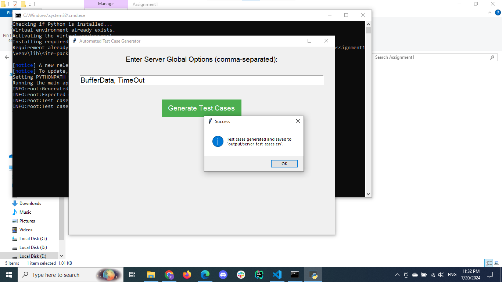

# Assignment 1

## Code Structure

```
Assignment1/
│
|── output/
│   └── server_test_cases.csv
│
├── src/
│   ├── __init__.py
│   ├── main.py
│   ├── test_case_generator.py
│   └── ui.py
|
├── README.md
│
└── run.bat
```

## Getting Started

1. **Clone the Repository**
    First, clone the repository to your local machine using the following command:

    ```sh
    git clone https://github.com/itsHamdySalem/Automated-Test-Case-Generator
    ```

2. **Navigate to Assignment1 Directory**
    Change your directory to Assignment1 folder:

    ```sh
    cd Automated-Test-Case-Generator/Assignment1
    ```

3. **Run the Batch File**
    The project includes a batch file (`run.bat`) that automates the setup and execution process. Run this file by double-clicking on it in the File Explorer or by using the following command in the terminal:

    ```sh
    ./run.bat
    ```

    This batch file will:
    * Check if Python is installed
    * Create and activate a virtual environment
    * Install the required libraries
    * Set the `PYTHONPATH` to include the `src` directory
    * Run the main application

4. **Run the Test Cases Generator Directly**
    You can also run the test case generator directly using the following command:

    ```sh
    python ./src/test_case_generator.py
    ```

## Screenshots

1. **Running the Batch File**


2. **Enter Global Options**


3. **Test Cases Generated**



4. **CSV Output File**


