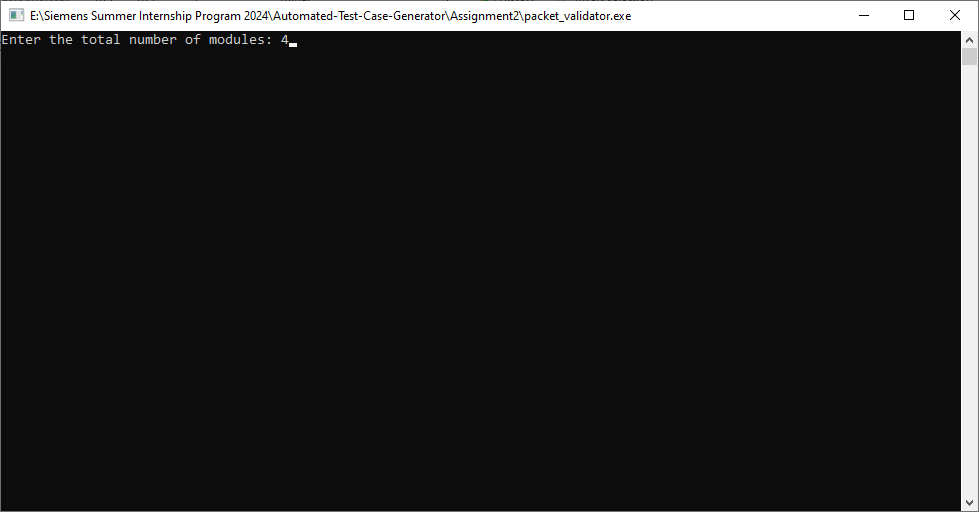
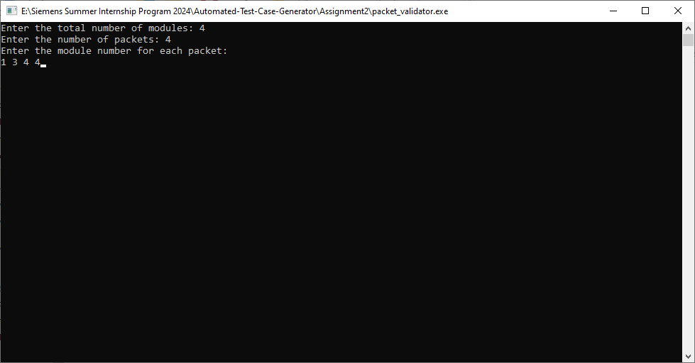

# Assignment 2

## Code Structure

```
Assignment2/
│
|── include/
│   └── packet_validator.h
│
|── output/
│   └── packet_validation.csv
│
├── src/
│   ├── main.cpp
│   └── packet_validator.cpp
|
├── Makefile
│
└── README.md
```

## Getting Started

1. **Clone the Repository**
    First, clone the repository to your local machine using the following command:

    ```sh
    git clone https://github.com/itsHamdySalem/Automated-Test-Case-Generator
    ```

2. **Navigate to Assignment2 Directory**
    Change your directory to Assignment2 folder:

    ```sh
    cd Automated-Test-Case-Generator/Assignment2
    ```

3. **Build the Project**
    Ensure you have `g++` installed and then run the following command:

    ```sh
    make
    ```

4. **Run the Application**
    Run the Application by double-clicking on the `packet_validator.exe` in the File Explorer or by using the following command in the terminal:

    ```sh
    ./packet_validator.exe
    ```

## Screenshots
1. **Entering the total number of modules**



2. **Entering the module number for each packet**



3. **CSV Output File**


